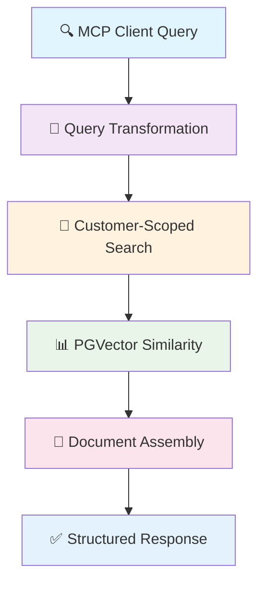
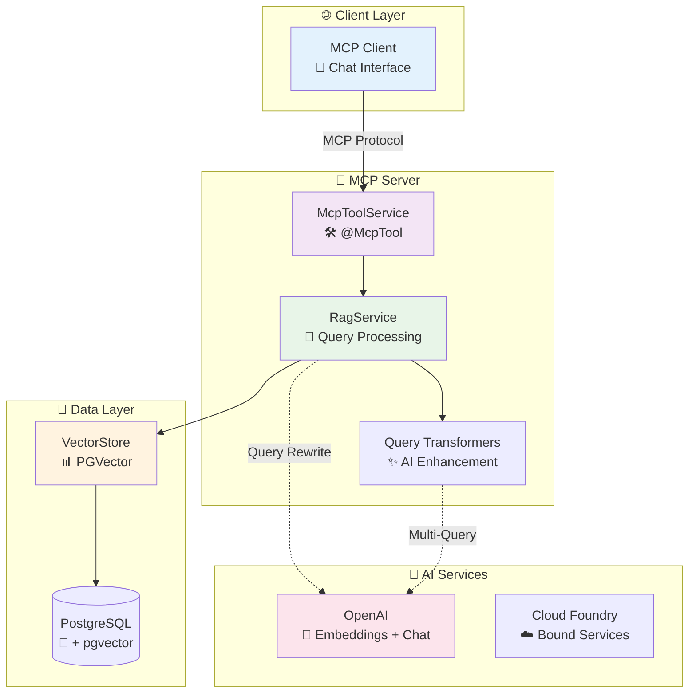

# 🏢 IMC Policy MCP Server

<div align="center">

[](https://docs.spring.io/spring-ai/reference/1.1/)
[](https://spring.io/projects/spring-boot)
[](https://openjdk.org/)
[](https://github.com/pgvector/pgvector)
[](https://modelcontextprotocol.io/)

**🚀 Enterprise-Grade RAG-Powered Insurance Policy Document Retrieval via Model Context Protocol**

*Intelligent document search with customer-scoped retrieval, query rewriting, and multi-query expansion*

</div>

---

## 📋 Table of Contents

- [🎯 Overview](#-overview)
- [✨ Features](#-features)
- [🏗️ Architecture](#️-architecture)
- [🚀 Quick Start](#-quick-start)
- [⚙️ Configuration](#️-configuration)
- [🔧 Development](#-development)
- [🐳 Deployment](#-deployment)
- [📊 Monitoring](#-monitoring)
- [🧪 Testing](#-testing)
- [📚 API Documentation](#-api-documentation)

---

## 🎯 Overview

The **IMC Policy MCP Server** is a production-ready **Model Context Protocol (MCP)** server that provides intelligent insurance policy document retrieval using advanced **Retrieval-Augmented Generation (RAG)** techniques. Built with Spring AI 1.1.0-SNAPSHOT, it offers customer-scoped document search with enterprise-grade performance and security.

### 🎨 Key Highlights



---

## ✨ Features

### 🔥 Core Capabilities

| Feature | Description | Status |
|---------|-------------|--------|
| 🎯 **Customer-Scoped RAG** | Secure document retrieval filtered by customer ID | ✅ Production Ready |
| 🧠 **Query Rewriting** | AI-powered query enhancement for better results | ✅ Configurable |
| 🔍 **Multi-Query Expansion** | Generate diverse query variations | ✅ Optional |
| 📊 **PGVector Integration** | High-performance vector similarity search | ✅ HNSW Index |
| 🔧 **MCP Tool Exposure** | Standards-compliant tool interface | ✅ @McpTool |
| 🚀 **Auto-Configuration** | Zero-config Spring Boot setup | ✅ Environment Aware |

### 🛡️ Enterprise Features

- **🔐 Security**: Customer data isolation with metadata filtering
- **📈 Performance**: Optimized vector search with configurable similarity thresholds
- **🔄 Scalability**: Cloud Foundry and containerization support
- **📊 Monitoring**: Comprehensive logging and health checks
- **🧪 Testing**: Full test suite with disabled integration tests
- **📝 Documentation**: Auto-generated API documentation

---

## 🏗️ Architecture

### 🏛️ System Architecture



### 🧩 Component Overview

| Component | Technology | Purpose |
|-----------|------------|---------|
| **McpToolService** | Spring AI MCP | Exposes `answerQuery` tool via MCP protocol |
| **RagService** | Spring AI RAG | Processes queries with customer-scoped retrieval |
| **Query Transformers** | Spring AI | RewriteQueryTransformer + MultiQueryExpander |
| **VectorStore** | PGVector | 768-dimension embeddings with HNSW index |
| **DataLoaderService** | Spring Boot | CSV ingestion with validation and error handling |

---

## 🚀 Quick Start

### 📋 Prerequisites

```bash
# Required Software
☑️ Java 21+
☑️ Docker & Docker Compose
☑️ Maven 3.8+
☑️ PostgreSQL 15+ (with pgvector extension)
```

### ⚡ 1-Minute Setup

```bash
# 1️⃣ Clone and navigate
git clone https://github.com/dbbaskette/imc-policy-mcp-server
cd imc-policy-mcp-server

# 2️⃣ Configure environment
cp .env.example .env
# Edit .env with your OpenAI API key and ensure OPENAI_TEMPERATURE=1.0 for gpt-5-nano

# 3️⃣ Start everything with one command! 🎉
./mcp-server.sh --build --local --docker
```

### 🎯 Manual Setup

<details>
<summary>Click to expand manual setup instructions</summary>

```bash
# Build the application
mvn clean package -DskipTests

# Start PostgreSQL with pgvector
docker-compose up -d

# Run the server
java -Dspring.profiles.active=local -jar target/imc-policy-mcp-server-*.jar
```

</details>

---

## ⚙️ Configuration

### 🌍 Environment Profiles

| Profile | Use Case | Database | AI Services |
|---------|----------|----------|-------------|
| `local` | Development | Local PostgreSQL | OpenAI API |
| `cloud` | Production | CF PostgreSQL | CF Bound Services |

### 🎛️ Key Configuration Options

```yaml
# 🧠 RAG Configuration
app.rag.top-k: 5                    # Number of documents to retrieve
app.rag.similarity-threshold: 0.7   # Minimum similarity score
app.rag.query-rewrite: true         # Enable AI query enhancement
app.rag.multi-query: false          # Enable query expansion
app.rag.multi-query-count: 3        # Number of query variations

# 📊 Vector Store Configuration  
spring.ai.vectorstore.pgvector.dimensions: 768
spring.ai.vectorstore.pgvector.distance-type: COSINE_DISTANCE
spring.ai.vectorstore.pgvector.index-type: HNSW

# 🔧 Data Loading
app.data.load-sample-data: true     # Load CSV data on startup
```

### 🔑 Environment Variables

Create `.env` file from `.env.example`:

> **⚠️ Important**: The `gpt-5-nano` model requires `OPENAI_TEMPERATURE=1.0` as it doesn't support custom temperature values. The server will automatically configure this for query rewriting and multi-query expansion.

```bash
# 🤖 OpenAI Configuration
OPENAI_API_KEY=your_openai_api_key_here
OPENAI_MODEL=gpt-5-nano
OPENAI_TEMPERATURE=1.0
OPENAI_EMBEDDING_MODEL=text-embedding-3-small

# 💾 Database Configuration  
DB_HOST=localhost
DB_PORT=5432
DB_NAME=imc_policy
DB_USER=imc_user
DB_PASSWORD=imc_password

# 🎯 RAG Tuning
RAG_TOP_K=5
RAG_SIMILARITY_THRESHOLD=0.7
RAG_QUERY_REWRITE=true
```

---

## 🔧 Development

### 🛠️ Development Commands

```bash
# 🔨 Build and test
./mcp-server.sh --build --skip-tests

# 🧪 Run with test database
./mcp-server.sh --local --docker

# 🚀 Build and run everything
./mcp-server.sh --build --local --docker

# 🧹 Stop Docker services
./mcp-server.sh --stop-docker

# ☁️ Deploy to Cloud Foundry
./mcp-server.sh --build --cf
```

### 📊 Health Checks & Testing

```bash
# 🏥 Health check
curl http://localhost:8080/actuator/health

# 🧪 Test RAG functionality (local profile only)
curl "http://localhost:8080/api/test/rag?query=What is covered?&customerId=100001"

# 📋 Get service info
curl http://localhost:8080/api/test/rag/info

# 📝 Sample queries
curl http://localhost:8080/api/test/samples
```

### 🎯 MCP Tool Usage

The server exposes the `answerQuery` tool that can be called by MCP clients:

```json
{
  "tool": "answerQuery",
  "parameters": {
    "query": "What does my auto insurance policy cover?",
    "customerId": 100001
  }
}
```

**Response:**
```json
{
  "success": true,
  "query": "What does my auto insurance policy cover?",
  "customerId": 100001,
  "context": "Document 1:\nAuto insurance policy coverage details...",
  "processingTimeMs": 1250,
  "timestamp": 1699123456789
}
```

---

## 🐳 Deployment

### 🏗️ Local Development

```bash
# Quick development setup
docker-compose up -d              # Start PostgreSQL
./mcp-server.sh --local --docker  # Run application
```

### ☁️ Cloud Foundry Deployment

```bash
# Deploy to Cloud Foundry
./mcp-server.sh --build --cf

# Monitor deployment
cf apps
cf logs imc-policy-mcp-server --recent
```

### 🐋 Docker Deployment

<details>
<summary>Docker deployment instructions</summary>

```dockerfile
# Dockerfile (not included, but you can create one)
FROM openjdk:21-jdk-slim
COPY target/imc-policy-mcp-server-*.jar app.jar
EXPOSE 8080
ENTRYPOINT ["java", "-jar", "/app.jar"]
```

```bash
# Build and run
docker build -t imc-policy-mcp-server .
docker run -p 8080:8080 -e SPRING_PROFILES_ACTIVE=local imc-policy-mcp-server
```

</details>

---

## 📊 Monitoring

### 📈 Actuator Endpoints

| Endpoint | Purpose | Example |
|----------|---------|---------|
| `/actuator/health` | Health status | `{"status":"UP"}` |
| `/actuator/info` | Application info | Build details |
| `/actuator/metrics` | Performance metrics | JVM, HTTP stats |

### 🔍 Logging Configuration

```yaml
# Debug logging for development
logging.level.com.insurancemegacorp.policymcpserver: DEBUG
logging.level.org.springframework.ai.vectorstore: DEBUG

# Production logging
logging.level.com.insurancemegacorp.policymcpserver: INFO
logging.level.org.springframework.ai: WARN
```

### 📊 Performance Metrics

Monitor these key metrics:
- **Query Response Time**: Typical 500-2000ms
- **Vector Search Performance**: Sub-100ms for similarity search
- **Document Retrieval**: 5-10 documents per query
- **Memory Usage**: ~512MB heap for typical workloads

---

## 🧪 Testing

### 🎯 Test Strategy

```bash
# Run all tests (currently skipped due to JDK compatibility)
mvn test

# Run specific test suites
mvn test -Dtest=*Service*
mvn test -Dtest=*Controller*
```

### 🧪 Test Categories

| Test Type | Status | Description |
|-----------|--------|-------------|
| **Unit Tests** | ⚠️ Skipped | Mockito/JDK 24 compatibility issues |
| **Integration Tests** | ⚠️ Skipped | ApplicationContext loading issues |
| **Manual Testing** | ✅ Available | REST endpoints for manual testing |

### 📝 Sample Test Queries

```bash
# Test with different customer IDs
curl "http://localhost:8080/api/test/rag?query=What is my deductible?&customerId=100001"
curl "http://localhost:8080/api/test/rag?query=Claims process&customerId=100002"
curl "http://localhost:8080/api/test/rag?query=Coverage details&customerId=100003"
```

---

## 📚 API Documentation

### 🛠️ MCP Tools

#### `answerQuery`

**Description**: Answer questions about customer's insurance policy documents using RAG

**Parameters**:
- `query` (string, required): Customer's question about their policy
- `customerId` (integer, required): Customer ID for document filtering

**Returns**: `PolicyQueryResult` with context and metadata

**Example**:
```json
{
  "success": true,
  "query": "What is covered under my policy?",
  "customerId": 100001,
  "context": "Document 1:\nYour auto insurance policy covers...",
  "processingTimeMs": 1250,
  "timestamp": 1699123456789
}
```

### 🧪 Test Endpoints (Local Profile Only)

| Endpoint | Method | Purpose |
|----------|--------|---------|
| `/api/test/rag` | GET | Test RAG query processing |
| `/api/test/rag/info` | GET | Get RAG service configuration |
| `/api/test/health` | GET | Test controller health check |
| `/api/test/samples` | GET | Get sample queries and customer IDs |

---

## 🎯 Data Model

### 📄 Document Structure

```json
{
  "id": "550e8400-e29b-41d4-a716-446655440001",
  "content": "Auto insurance policy coverage details...",
  "metadata": {
    "customerId": 100001,
    "policyType": "auto", 
    "policyNumber": "POL-2024-001",
    "documentType": "coverage",
    "effectiveDate": "2024-01-15"
  },
  "embedding": [0.1, 0.2, ...] // 768-dimensional vector
}
```

### 🔍 Customer Filtering

Documents are filtered using `metadata.refnum1 == customerId` ensuring secure, customer-scoped retrieval.

---

## 🤝 Contributing

### 🔧 Development Setup

1. **Fork the repository**
2. **Create feature branch**: `git checkout -b feature/amazing-feature`
3. **Make changes and test**
4. **Commit with conventional commits**: `git commit -m "feat: add amazing feature"`
5. **Push and create PR**: `git push origin feature/amazing-feature`

### 📋 Code Standards

- ✅ Java 21 features and best practices
- ✅ Spring Boot 3.x conventions
- ✅ Comprehensive error handling
- ✅ Clear, concise documentation
- ✅ Performance-optimized implementations

---

## 📄 License

This project is licensed under the **MIT License** - see the [LICENSE](LICENSE) file for details.

---

## 🙋‍♂️ Support

### 🆘 Getting Help

- 📧 **Email**: [support@insurancemegacorp.com](mailto:support@insurancemegacorp.com)
- 🐛 **Issues**: [GitHub Issues](https://github.com/dbbaskette/imc-policy-mcp-server/issues)
- 📖 **Documentation**: [Spring AI Docs](https://docs.spring.io/spring-ai/reference/1.1/)

### 🔗 Related Projects

- [Spring AI](https://github.com/spring-projects/spring-ai) - AI Integration Framework
- [PGVector](https://github.com/pgvector/pgvector) - Vector Database Extension
- [Model Context Protocol](https://modelcontextprotocol.io/) - MCP Specification

---

<div align="center">

**🌟 Star this repository if you find it helpful! 🌟**

Made with ❤️ by the Insurance MegaCorp Team

</div>