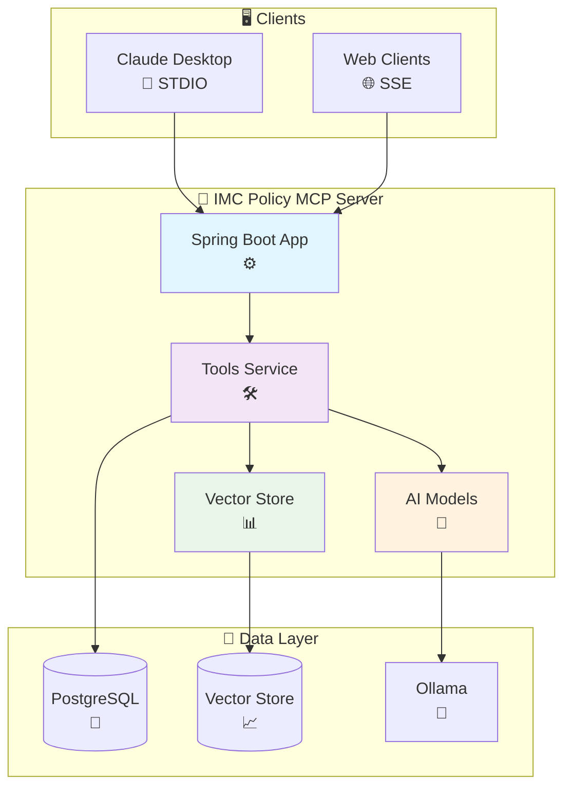

<div align="center">


# 🏢 IMC Policy MCP Server

[](https://openjdk.org/projects/jdk/21/)
[](https://spring.io/projects/spring-boot)
[](https://docs.spring.io/spring-ai/reference/)
[](https://modelcontextprotocol.github.io/specification/)
[](https://www.docker.com/)

**🚀 A comprehensive Model Context Protocol (MCP) server for Insurance MegaCorp policy operations**  
*Built with Spring AI, featuring RAG capabilities and dual transport modes*

</div>

---

## 📋 Table of Contents

- [✨ Features](#-features)
- [🏗️ Architecture](#️-architecture)
- [🚀 Quick Start](#-quick-start)
- [🔧 Configuration](#-configuration)
- [🛠️ Available Tools](#️-available-tools)
- [🧪 Testing](#-testing)
- [🖥️ Claude Desktop Integration](#️-claude-desktop-integration)
- [📊 Development](#-development)
- [🔗 Resources](#-resources)

---

## ✨ Features

<table>
<tr>
<td width="50%">

### 🌟 **Core Capabilities**
- 🤖 **Dual AI Models**: Ollama (local) with fallback support
- 🗂️ **Vector RAG**: PostgreSQL + PGVector for document search
- 🔄 **Dual Transport**: STDIO (Claude Desktop) + SSE (Web clients)
- 🏢 **Insurance Domain**: Customer and policy management tools
- 📊 **Testcontainers**: Automated local development setup

</td>
<td width="50%">

### ⚡ **Technical Stack**
- ☕ **Java 21**: Latest LTS with modern features
- 🍃 **Spring Boot 3.5.3**: Production-ready framework
- 🧠 **Spring AI 1.0.0**: Cutting-edge AI integration
- 🐘 **PostgreSQL + PGVector**: Vector database for RAG
- 🐋 **Docker**: Containerized development environment

</td>
</tr>
</table>

---

## 🏗️ Architecture


```mermaid
graph TB
    subgraph "🖥️ Clients"
        A[Claude Desktop<br/>📱 STDIO]
        B[Web Clients<br/>🌐 SSE]
    end
    
    subgraph "🚀 IMC Policy MCP Server"
        C[Spring Boot App<br/>⚙️]
        D[Tools Service<br/>🛠️]
        E[Vector Store<br/>📊]
        F[AI Models<br/>🤖]
    end
    
    subgraph "💾 Data Layer"
        G[(PostgreSQL<br/>🐘)]
        H[(Vector Store<br/>📈)]
        I[Ollama<br/>🦙]
    end
    
    A --> C
    B --> C
    C --> D
    D --> E
    D --> F
    E --> H
    F --> I
    D --> G
    
    style C fill:#e1f5fe
    style D fill:#f3e5f5
    style E fill:#e8f5e8
    style F fill:#fff3e0
```

### 🏢 **Project Structure**
```
📁 imc-policy-mcp-server/
├── 📁 src/main/java/com/baskettecase/mcpserver/
│   ├── 🎯 McpServerApplication.java       # Main application
│   ├── 📁 config/
│   │   ├── ⚙️ ModelConfiguration.java    # AI model setup
│   │   └── 🗄️ DatabaseConfiguration.java # Database setup
│   ├── 📁 service/
│   │   ├── 🛠️ ToolsService.java          # MCP tools
│   │   ├── 🤖 LLMService.java            # Chat model service
│   │   ├── 🔢 EmbeddingService.java      # Embedding service
│   │   ├── 📊 VectorStoreService.java    # Vector operations
│   │   └── 🧪 AIModelTestService.java    # AI testing
│   ├── 📁 model/                          # JPA entities
│   └── 📁 repository/                     # Data repositories
├── 📁 src/main/resources/
│   ├── ⚙️ application*.properties        # Profiles config
│   ├── 🗄️ schema.sql                     # Database schema  
│   └── 📊 data.sql                       # Sample data
├── 📁 src/test/                          # Comprehensive tests
└── 🧪 test-mcp.sh                       # Testing script
```

---

## 🚀 Quick Start

### 📋 **Prerequisites**

<table>
<tr>
<td align="center">☕<br/><strong>Java 21+</strong></td>
<td align="center">📦<br/><strong>Maven 3.6+</strong></td>
<td align="center">🐋<br/><strong>Docker Desktop</strong></td>
<td align="center">🦙<br/><strong>Ollama</strong></td>
</tr>
</table>

### ⚡ **One-Command Setup**

```bash
# 🏗️ Build and test everything
./test-mcp.sh --local --sse --build --test-tools
```

<details>
<summary>📖 <strong>Step-by-Step Setup</strong></summary>

#### 1️⃣ **Install Ollama Models**
```bash
# 💬 Install chat model
ollama pull llama3.2:3b

# 🔤 Install embedding model  
ollama pull nomic-embed-text:latest
```

#### 2️⃣ **Build the Project**
```bash
mvn clean install
```

#### 3️⃣ **Run the Server**
```bash
# 🖥️ For Claude Desktop (STDIO)
./test-mcp.sh --local --stdio

# 🌐 For web clients (SSE)  
./test-mcp.sh --local --sse
```

</details>

---

## 🔧 Configuration

### 🏠 **Local Development Profiles**

| Profile | Transport | Database | AI Models | Use Case |
|---------|-----------|----------|-----------|----------|
| 🖥️ `local-stdio` | STDIO | TestContainers PostgreSQL | 🦙 Ollama | Claude Desktop |
| 🌐 `local-sse` | SSE | H2 In-Memory | 🦙 Ollama | Web Development |

### ⚙️ **Environment Variables**

```bash
# 🦙 Ollama Configuration
export OLLAMA_BASE_URL="http://localhost:11434"
export OLLAMA_CHAT_MODEL="llama3.2:3b" 
export OLLAMA_EMBEDDING_MODEL="nomic-embed-text:latest"
```

---

## 🛠️ Available Tools

<div align="center">

### 🏢 **Insurance Policy Tools**

</div>

| Tool | Description | Parameters | Example |
|------|-------------|------------|---------|
| 👤 **queryCustomer** | Get customer information | `customerId` (Integer) | `queryCustomer(100001)` |
| 🧪 **testAIModels** | Test AI connectivity | None | `testAIModels()` |
| 🗄️ **testDatabase** | Test database connectivity | None | `testDatabase()` |

<details>
<summary>🔍 <strong>Tool Details</strong></summary>

#### 👤 **Customer Query Tool**
```javascript
// 📞 Example Response
{
  "customer_id": 100001,
  "name": "John Doe", 
  "email": "john.doe@email.com",
  "phone": "555-0101",
  "address": "123 Main St, Atlanta, GA 30309"
}
```

#### 🧪 **AI Model Testing**
```bash
# 🤖 Tests both chat and embedding models
✅ LLM service is working using OllamaChatModel
✅ Embedding service is working using OllamaEmbeddingModel
```

</details>

---

## 🧪 Testing

### 🎯 **Smart Test Script**

The `./test-mcp.sh` script provides comprehensive testing with beautiful colored output:

```bash
# 🎨 Available test options
./test-mcp.sh --local --sse --test-tools     # 🌐 Test SSE with tools
./test-mcp.sh --local --stdio --test-tools   # 🖥️ Test STDIO with tools  
./test-mcp.sh --local --sse --build          # 🏗️ Build then test SSE
```

### 📊 **Test Coverage**

<div align="center">

| Component | Tests | Status |
|-----------|-------|--------|
| 🛠️ Tools Service | ✅ 5 tests | 100% Pass |
| 👤 Customer Queries | ✅ 3 tests | 100% Pass |
| 🗄️ Database Connectivity | ✅ 2 tests | 100% Pass |
| **📊 Total** | **✅ 5 tests** | **🎯 100% Pass** |

</div>

### 🎨 **Test Output Example**

```
╔══════════════════════════════════════════╗
║      IMC Policy MCP Server Tester        ║
╚══════════════════════════════════════════╝

✅ JAR file found
⚙️ Configuration:
  Environment: local 🏠
  Transport: sse
  
🧪 🏠 Local Development Environment
• Testcontainers PostgreSQL with sample data and vector database
• Requires Docker Desktop to be running

⚙️ AI Model Configuration:
✓ Ollama CLI detected (Local development models)
  Chat Model: llama3.2:3b
  Embedding Model: nomic-embed-text:latest
  Base URL: http://localhost:11434

⚙️ Local Profile Configuration:
• Uses Ollama models exclusively for simplicity
• No OpenAI integration in local profiles  
• Requires Ollama server running on localhost:11434
```

---

## 🖥️ Claude Desktop Integration

### 1️⃣ **Configuration**

Add to your `claude_desktop_config.json`:

```json
{
  "mcpServers": {
    "imc-policy-server": {
      "command": "java",
      "args": [
        "-Dspring.profiles.active=local-stdio", 
        "-jar",
        "/path/to/imc-policy-mcp-server/target/imc-policy-mcp-server-0.0.1-SNAPSHOT.jar"
      ]
    }
  }
}
```

### 2️⃣ **Usage Examples**

Try these queries in Claude Desktop:

- 🔍 *"Can you look up customer information for ID 100001?"*
- 🧪 *"Test the AI models connectivity"*
- 📊 *"Check if the database is working properly"*

---

## 📊 Development

### 🔨 **Adding New Tools**

```java
@Tool(description = "Your amazing new tool")
public String yourNewTool(String parameter) {
    // 🚀 Your implementation here
    return "Amazing result!";
}
```

### 🏃‍♂️ **Running Locally**

```bash
# 🛠️ Development mode
mvn spring-boot:run -Dspring-boot.run.profiles=local-sse

# 🧪 Test mode  
mvn test
```

### 🎯 **Code Documentation**

Key services are thoroughly documented:

- 🛠️ **ToolsService**: MCP tool implementations with database integration
- 🤖 **LLMService**: Chat model operations for query expansion and answering
- 🔢 **EmbeddingService**: Text embedding for vector search
- 📊 **VectorStoreService**: Vector database operations with customer filtering

---

## 🔗 Resources

<div align="center">

### 📚 **Documentation & Guides**

[](https://docs.spring.io/spring-ai/reference/)
[](https://modelcontextprotocol.github.io/specification/)
[](https://claude.ai/mcp)
[](https://ollama.ai/)

</div>

---

<div align="center">

### 🎉 **Ready to revolutionize insurance policy management!**

*Built with ❤️ by the Insurance MegaCorp Development Team*

---

**🚀 Happy Coding!** | **📧 Questions?** File an issue | **⭐ Star this repo** if it helps!

</div>