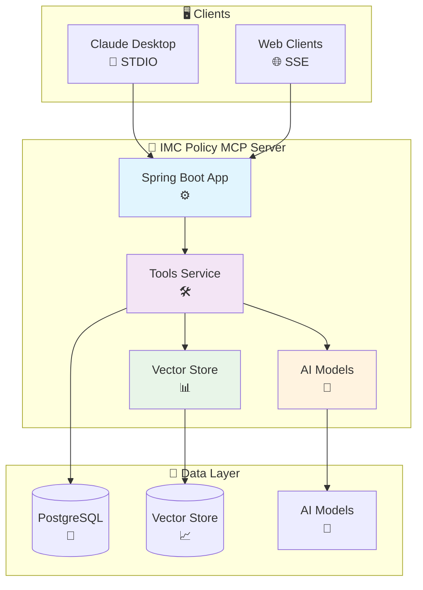

<div align="center">


# 🏢 IMC Policy MCP Server

[](https://openjdk.org/projects/jdk/21/)
[](https://spring.io/projects/spring-boot)
[](https://docs.spring.io/spring-ai/reference/)
[](https://modelcontextprotocol.github.io/specification/)
[](https://www.docker.com/)

**🚀 A comprehensive Model Context Protocol (MCP) server for Insurance MegaCorp policy operations**  
*Built with Spring AI, featuring RAG capabilities and dual transport modes*

</div>

---

## 📋 Table of Contents

- [✨ Features](#-features)
- [🏗️ Architecture](#️-architecture)
- [🚀 Quick Start](#-quick-start)
- [🔧 Configuration](#-configuration)
- [🛠️ Available Tools](#️-available-tools)
- [🧪 Testing](#-testing)
- [🖥️ Claude Desktop Integration](#️-claude-desktop-integration)
- [📊 Development](#-development)
- [🔗 Resources](#-resources)

---

## ✨ Features

<table>
<tr>
<td width="50%">

### 🌟 **Core Capabilities**
- 🎯 **Atomic Model Profiles**: Independent chat and embedding model selection
- 🤖 **Multi-AI Support**: OpenAI, Ollama, and hybrid configurations
- 🗂️ **Vector RAG**: PostgreSQL + PGVector for document search
- 🔄 **Dual Transport**: STDIO (Claude Desktop) + SSE (Web clients)
- 🏢 **Insurance Domain**: Customer and policy management tools
- 📊 **Testcontainers**: Automated local development setup
- ☁️ **Cloud Ready**: Cloud Foundry deployment with health monitoring

</td>
<td width="50%">

### ⚡ **Technical Stack**
- ☕ **Java 21**: Latest LTS with modern features
- 🍃 **Spring Boot 3.5.3**: Production-ready framework
- 🧠 **Spring AI 1.0.0**: Cutting-edge AI integration
- 🐘 **PostgreSQL + PGVector**: Vector database for RAG
- 🐋 **Docker**: Containerized development environment
- 📊 **Spring Actuator**: Health checks and monitoring
- ☁️ **Cloud Foundry**: Enterprise deployment platform

</td>
</tr>
</table>

---

## 🏗️ Architecture


```mermaid
graph TB
    subgraph "🖥️ Clients"
        A[Claude Desktop<br/>📱 STDIO]
        B[Web Clients<br/>🌐 SSE]
    end
    
    subgraph "🚀 IMC Policy MCP Server"
        C[Spring Boot App<br/>⚙️]
        D[Tools Service<br/>🛠️]
        E[Vector Store<br/>📊]
        F[AI Models<br/>🤖]
    end
    
    subgraph "💾 Data Layer"
        G[(PostgreSQL<br/>🐘)]
        H[(Vector Store<br/>📈)]
        I[AI Models<br/>🤖]
    end
    
    A --> C
    B --> C
    C --> D
    D --> E
    D --> F
    E --> H
    F --> I
    D --> G
    
    style C fill:#e1f5fe
    style D fill:#f3e5f5
    style E fill:#e8f5e8
    style F fill:#fff3e0
```

### 🏢 **Project Structure**
```
📁 imc-policy-mcp-server/
├── 📁 src/main/java/com/baskettecase/mcpserver/
│   ├── 🎯 McpServerApplication.java       # Main application
│   ├── 📁 config/
│   │   ├── ⚙️ ModelConfiguration.java    # AI model setup
│   │   └── 🗄️ DatabaseConfiguration.java # Database setup
│   ├── 📁 service/
│   │   ├── 🛠️ ToolsService.java          # MCP tools
│   │   ├── 🤖 LLMService.java            # Chat model service
│   │   ├── 🔢 EmbeddingService.java      # Embedding service
│   │   ├── 📊 VectorStoreService.java    # Vector operations
│   │   └── 🧪 AIModelTestService.java    # AI testing
│   ├── 📁 model/                          # JPA entities
│   └── 📁 repository/                     # Data repositories
├── 📁 src/main/resources/
│   ├── ⚙️ application*.properties        # Profiles config
│   ├── 🗄️ schema.sql                     # Database schema  
│   └── 📊 data.sql                       # Sample data
├── 📁 src/test/                          # Comprehensive tests
├── 📁 scripts/
│   └── 🔧 create-cf-services.sh          # Cloud Foundry setup
├── 🧪 test-mcp.sh                       # Testing script
├── ☁️ manifest.yml.template              # CF deployment template
└── 📖 cloud-foundry-deployment.md        # Deployment guide
```

---

## 🚀 Quick Start

### 📋 **Prerequisites**

<table>
<tr>
<td align="center">☕<br/><strong>Java 21+</strong></td>
<td align="center">📦<br/><strong>Maven 3.6+</strong></td>
<td align="center">🐋<br/><strong>Docker Desktop</strong></td>
<td align="center">🦙<br/><strong>Ollama</strong><br/><small>(for local models)</small></td>
<td align="center">🔑<br/><strong>OpenAI API Key</strong><br/><small>(for cloud models)</small></td>
</tr>
</table>

### ⚡ **One-Command Setup**

```bash
# 🏗️ Recommended hybrid setup (reliable chat + free embeddings)
./test-mcp.sh --local --sse --chat-openai --embed-ollama --build --test-tools
```

<details>
<summary>📖 <strong>Step-by-Step Setup</strong></summary>

#### 1️⃣ **Setup Environment**
```bash
# 🔑 Set OpenAI API key (for hybrid setup)
export OPENAI_API_KEY="your-api-key-here"

# 🦙 Install Ollama models (for local/hybrid setup)
ollama pull phi3                    # Chat model
ollama pull nomic-embed-text        # Embedding model
```

#### 2️⃣ **Build the Project**
```bash
mvn clean install
```

#### 3️⃣ **Choose Your AI Setup**
```bash
# 🎯 Recommended: Hybrid (OpenAI chat + Ollama embeddings)
./test-mcp.sh --local --sse --chat-openai --embed-ollama

# 💰 Pure local (no API costs)
./test-mcp.sh --local --sse --chat-ollama --embed-ollama

# ☁️ Pure cloud (maximum reliability)
./test-mcp.sh --cloud --chat-openai --embed-openai

# 🖥️ Claude Desktop integration
./test-mcp.sh --local --stdio --chat-openai --embed-ollama
```

</details>

---

## 🔧 Configuration

### 🎯 **Atomic Model Profile Architecture**

The application uses atomic profiles for maximum flexibility in AI model selection. Instead of monolithic profiles, you can independently choose:

- **1 Transport Profile**: How the MCP server communicates (STDIO, SSE, or Cloud)
- **1 Chat Profile**: Which chat model to use (OpenAI or Ollama)  
- **1 Embedding Profile**: Which embedding model to use (OpenAI or Ollama)

This allows **4 atomic profiles to create unlimited combinations**:

#### **✨ Benefits of Atomic Profiles**
- 💰 **Cost Control**: Use free local models for embeddings, paid APIs for chat
- 🔄 **Easy Switching**: Change models without touching code
- 🎯 **Optimized Performance**: Choose the best model for each task
- 🛡️ **Risk Mitigation**: Fallback between local and cloud providers
- 📊 **Flexible Deployment**: Different configs for dev, staging, production

#### **🚀 Transport Profiles** (choose one)
| Profile | Transport | Database | Use Case |
|---------|-----------|----------|----------|
| 🖥️ `local-stdio` | STDIO | TestContainers PostgreSQL | Claude Desktop integration |
| 🌐 `local-sse` | SSE | TestContainers PostgreSQL | Web development & testing |
| ☁️ `cloud` | SSE | External PostgreSQL | Production deployment |

#### **🤖 AI Model Profiles** (choose one chat + one embedding)
| Profile | Type | Model | Cost | Performance |
|---------|------|-------|------|-------------|
| 💬 `chat-openai` | Chat | gpt-4.1-nano | $$$ | ⭐⭐⭐⭐⭐ |
| 💬 `chat-ollama` | Chat | phi3 | FREE | ⭐⭐⭐⭐ |
| 🔤 `embed-openai` | Embedding | text-embedding-3-small | $$$ | ⭐⭐⭐⭐⭐ |
| 🔤 `embed-ollama` | Embedding | nomic-embed-text | FREE | ⭐⭐⭐⭐ |

#### **🎛️ Recommended Combinations**
```bash
# 🎯 Hybrid (Best of both worlds)
./test-mcp.sh --local --sse --chat-openai --embed-ollama

# 💰 Pure Local (No API costs)  
./test-mcp.sh --local --sse --chat-ollama --embed-ollama

# ☁️ Pure Cloud (Maximum reliability)
./test-mcp.sh --cloud --chat-openai --embed-openai
```

### ⚙️ **Environment Variables**

```bash
# 🔑 OpenAI Configuration (for OpenAI profiles)
export OPENAI_API_KEY="your-api-key-here"
export OPENAI_CHAT_MODEL="gpt-4.1-nano"              # Optional override
export OPENAI_EMBEDDING_MODEL="text-embedding-3-small" # Optional override

# 🦙 Ollama Configuration (for Ollama profiles)
export OLLAMA_BASE_URL="http://localhost:11434"
export OLLAMA_CHAT_MODEL="phi3"                      # Optional override
export OLLAMA_EMBEDDING_MODEL="nomic-embed-text"     # Optional override

# 🗄️ Database Configuration (for cloud profile)
export PGVECTOR_HOST="localhost"
export PGVECTOR_PORT="5432"
export PGVECTOR_DATABASE="policy_rag"
export PGVECTOR_USERNAME="postgres"
export PGVECTOR_PASSWORD="password"
```

---

## 🛠️ Available Tools

<div align="center">

### 🏢 **Insurance Policy Tools**

</div>

| Tool | Description | Parameters | Example |
|------|-------------|------------|---------|
| 👤 **queryCustomer** | Get customer information | `customerId` (Integer) | `queryCustomer(100001)` |
| 🧪 **testAIModels** | Test AI connectivity | None | `testAIModels()` |
| 🗄️ **testDatabase** | Test database connectivity | None | `testDatabase()` |
| 📊 **Health Check** | Actuator health endpoint | None | `GET /actuator/health` |

<details>
<summary>🔍 <strong>Tool Details</strong></summary>

#### 👤 **Customer Query Tool**
```javascript
// 📞 Example Response
{
  "customer_id": 100001,
  "name": "John Doe", 
  "email": "john.doe@email.com",
  "phone": "555-0101",
  "address": "123 Main St, Atlanta, GA 30309"
}
```

#### 🧪 **AI Model Testing**
```bash
# 🤖 Tests both chat and embedding models
✅ LLM service is working using OllamaChatModel
✅ Embedding service is working using OllamaEmbeddingModel
```

</details>

---

## 🧪 Testing

### 🎯 **Smart Test Script**

The `./test-mcp.sh` script provides comprehensive testing with beautiful colored output:

```bash
# 🎨 Available test options with atomic profiles
./test-mcp.sh --local --sse --chat-openai --embed-ollama --test-tools  # 🎯 Hybrid setup
./test-mcp.sh --local --stdio --chat-ollama --embed-ollama --test-tools # 🖥️ Pure local
./test-mcp.sh --cloud --chat-openai --embed-openai --build --test-tools # ☁️ Production test
```

### 📊 **Test Coverage**

<div align="center">

| Component | Tests | Status |
|-----------|-------|--------|
| 🛠️ Tools Service | ✅ 5 tests | 100% Pass |
| 👤 Customer Queries | ✅ 3 tests | 100% Pass |
| 🗄️ Database Connectivity | ✅ 2 tests | 100% Pass |
| **📊 Total** | **✅ 5 tests** | **🎯 100% Pass** |

</div>

### 🎨 **Test Output Example**

```
╔══════════════════════════════════════════╗
║      IMC Policy MCP Server Tester        ║
╚══════════════════════════════════════════╝

✅ JAR file found
⚙️ Configuration:
  Environment: local 🏠
  Transport: sse
  
🧪 🏠 Local Development Environment
• Testcontainers PostgreSQL with sample data and vector database
• Requires Docker Desktop to be running

⚙️ AI Model Configuration:
✓ OpenAI API key detected
  Chat: OpenAI gpt-4.1-nano ✓
  Embedding: Ollama nomic-embed-text ✓
  
🎯 Hybrid Configuration (Recommended):
• Chat: OpenAI for reliable responses
• Embeddings: Ollama for cost-effective vector operations
• Transport: SSE for web development
```

---

## 🖥️ Claude Desktop Integration

### 1️⃣ **Configuration**

Add to your `claude_desktop_config.json`:

```json
{
  "mcpServers": {
    "imc-policy-server": {
      "command": "java",
      "args": [
        "-Dspring.profiles.active=local-stdio,chat-openai,embed-ollama", 
        "-jar",
        "/path/to/imc-policy-mcp-server/target/imc-policy-mcp-server-0.0.1-SNAPSHOT.jar"
      ],
      "env": {
        "OPENAI_API_KEY": "your-api-key-here"
      }
    }
  }
}
```

**Profile Options:**
```json
// 🎯 Hybrid (recommended)
"spring.profiles.active=local-stdio,chat-openai,embed-ollama"

// 💰 Pure local  
"spring.profiles.active=local-stdio,chat-ollama,embed-ollama"

// ☁️ Pure cloud
"spring.profiles.active=local-stdio,chat-openai,embed-openai"
```

### 2️⃣ **Usage Examples**

Try these queries in Claude Desktop:

- 🔍 *"Can you look up customer information for ID 100001?"*
- 🧪 *"Test the AI models connectivity"*
- 📊 *"Check if the database is working properly"*

---

## 📊 Development

### 🔨 **Adding New Tools**

```java
@Tool(description = "Your amazing new tool")
public String yourNewTool(String parameter) {
    // 🚀 Your implementation here
    return "Amazing result!";
}
```

### 🏃‍♂️ **Running Locally**

```bash
# 🛠️ Development mode
mvn spring-boot:run -Dspring-boot.run.profiles=local-sse

# 🧪 Test mode  
mvn test
```

### ☁️ **Cloud Foundry Deployment**

```bash
# 🔧 Create required services
./scripts/create-cf-services.sh

# 📝 Copy and customize manifest
cp manifest.yml.template manifest.yml
# Edit manifest.yml with your CF domain

# 🚀 Deploy to Cloud Foundry
cf push

# 📊 Check application health
curl https://your-app.your-cf-domain.com/actuator/health
```

For detailed deployment instructions, see [`cloud-foundry-deployment.md`](./cloud-foundry-deployment.md).

### 🎯 **Code Documentation**

Key services are thoroughly documented:

- 🛠️ **ToolsService**: MCP tool implementations with database integration
- 🤖 **LLMService**: Chat model operations for query expansion and answering
- 🔢 **EmbeddingService**: Text embedding for vector search
- 📊 **VectorStoreService**: Vector database operations with customer filtering

---

## 🔗 Resources

<div align="center">

### 📚 **Documentation & Guides**

[](https://docs.spring.io/spring-ai/reference/)
[](https://modelcontextprotocol.github.io/specification/)
[](https://claude.ai/mcp)
[](https://ollama.ai/)

</div>

---

<div align="center">

### 🎉 **Ready to revolutionize insurance policy management!**

*Built with ❤️ by the Insurance MegaCorp Development Team*

---

**🚀 Happy Coding!** | **📧 Questions?** File an issue | **⭐ Star this repo** if it helps!

</div>